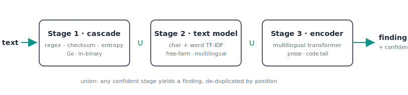

<p align="center">
  <picture>
    <source media="(prefers-color-scheme: dark)" srcset="assets/logo-dark.svg">
    
  </picture>
</p>

<p align="center"><b>English</b> · <a href="README.ru.md">Русский</a></p>

<p align="center">
  Find leaked credentials across code, git history, tickets, logs, container images, and shipped
  web apps - covering structured tokens and multilingual prose, with optional live verification.
</p>

<p align="center">
  <a href="#install"></a>
  
  
  
  
</p>

---

Prowl is a secret scanner. It reads a codebase, a git history, a live web page, or a stream of
text and reports the credentials someone left behind (API keys, tokens, database URIs, private
keys, passwords in prose) with a line, a column, and a confidence. The goal is
**high recall without drowning you in false positives.**

Most scanners force a choice. Regex tools (gitleaks, trufflehog) are precise on structured tokens
but miss anything without a fixed prefix; ML/semantic tools (deepsecrets) read free-form prose but
collapse on structured keys. Prowl runs both as one cascade - regex/checksum precision on structured
tokens, an ML stage for the multilingual prose that prefix tools miss, and optional live verification
on top. It does not claim the lowest false-positive count of every tool (a tuned prefix scanner like
gitleaks can be quieter on pure code); it aims for the widest honest coverage at a usable precision.
See [the benchmark](#benchmark) for the reproducible numbers and where each tool wins.

```console
$ prowl scan .

  src/config/prod.ts
    ✖ critical  aws_access_key_id      42:18   AKIA••••DSYP    live
  .env.example
    ✖ high      github_pat             3:11    ghp_••••a1b2
  docs/onboarding.md
    ⚠ medium    generic_password       88:24   Welc••••e!      71%

  3 findings  1 critical · 1 high · 1 medium  in 3 files
```

Findings are grouped by file (worst first), severity-coloured, with the secret masked. JSON
(`--format json`), SARIF (`--format sarif`, for the GitHub/GitLab Security tab), and DefectDojo
(`--format defectdojo`, Generic Findings Import for direct upload) are one flag away.

## Install

```sh
# Homebrew
brew install Lercas/tap/prowl

# Go
go install github.com/Lercas/prowl/tool/cmd/prowl@latest

# Docker
docker run --rm -v "$PWD:/src" ghcr.io/lercas/prowl scan /src

# binary - download from the GitHub Releases page (linux/macos/windows, amd64/arm64)
```

> **ML support in released binaries.** The Homebrew, Docker, and GitHub Release binaries are built
> static (`CGO_ENABLED=0`) and run the **cascade by default**. The in-process ML stage (`--ml`) needs
> a cgo build - a static release binary **refuses `--ml`** and exits with a message pointing you to
> `--ml-url` or a source build. To get ML, either run the model as a sidecar and pass `--ml-url`, or
> build from source with cgo (`cd tool && make build`, which sets `CGO_ENABLED=1`). The cascade,
> rule templates, and live `--verify` work in every build.

### Pre-commit

Drop Prowl into [pre-commit](https://pre-commit.com) - the same place you'd wire gitleaks:

```yaml
# .pre-commit-config.yaml
repos:
  - repo: https://github.com/Lercas/prowl
    rev: v1.0.0
    hooks:
      - id: prowl            # builds from source (needs Go), or:
      # - id: prowl-docker   # no Go toolchain, uses the published image
```

Migrating from gitleaks needs no rewrite: a `.gitleaks.toml` is auto-loaded, your `.gitleaksignore`
keeps the same findings suppressed, and `gitleaks:allow` comments are honored. Run `prowl compare`
to see how many of your current findings Prowl's ML stage flags as noise before you switch.

## Quick start

```sh
prowl scan .                       # scan the working tree
prowl scan . --staged              # only what's staged (pre-commit)
prowl scan . --since HEAD~50       # only the last 50 commits' diffs
prowl scan . --verify              # confirm each hit against the provider's API
prowl scan . --format sarif -o out.sarif    # for code scanning / CI

prowl repo https://github.com/org/repo   # clone a remote repo (GitHub/GitLab/Bitbucket) and scan it
GITHUB_TOKEN=... prowl org github:my-org   # scan every repo in an org/group/workspace
GITHUB_TOKEN=... prowl org github:my-user --gists   # scan a github user's public gists instead of repos
prowl image alpine:latest                # scan a container image - every layer + config (also a local tarball / oci-dir / stdin)
prowl bucket s3://my-logs/2026/          # download & scan an S3 / GCS prefix (uses your aws/gcloud CLI)
prowl mobile app.apk                     # unpack & scan an Android APK / iOS IPA (resources + binary strings)
kubectl get secret x -o yaml | prowl scan -   # scan piped input from stdin

prowl domain https://example.com --authorized   # HTML, JS bundles, source maps, __NEXT_DATA__
prowl domain --authorized --targets hosts.txt   # scan a newline-delimited host list with a worker pool
ATLASSIAN_EMAIL=... ATLASSIAN_API_TOKEN=... prowl jira https://acme.atlassian.net   # every issue version (Cloud/Server/DC)
ATLASSIAN_PAT=... prowl confluence https://wiki.acme.com    # every page version, from the first
prowl serve                        # stateless HTTP worker: POST /scan (cascade + rule templates; no in-process ML/verify)
prowl mcp                          # Model Context Protocol server over stdio: AI agents drive scans as tools
```

First run installs the rule and verifier libraries; after that they load automatically:

```sh
prowl rules update                 # fetch + validate + install ~/.prowl/rules
prowl verifiers update             # fetch + validate + install ~/.prowl/verifiers
prowl version                      # binary + installed library versions
```

### Cutting noise

Trim what a scan reports without touching a config file. These filters run at report time, over both built-in and template findings:

```sh
prowl scan . --min-severity high      # only high+ findings
prowl scan . --min-confidence 0.7     # drop weak, low-confidence guesses
prowl scan . --disable generic_high_entropy   # silence one noisy detector type
prowl scan . --no-dedupe              # show every occurrence (default: one per file)
prowl scan . --show-secrets           # print the FULL unredacted value + line context (authorized triage)
```

The same secret found repeatedly in one file is reported once by default; `--no-dedupe` shows them all. `--show-secrets` unmasks the full value and the surrounding line for authorized triage, feeding the ML feedback flywheel. [docs](wiki/Scanning-Files.md#cutting-noise)

Full reference for every command, flag, and feature is in the [wiki](wiki/README.md).

## What it can scan

One scanner, many sources - every one runs the same detection cascade and the same flags:

- **A directory or files** - `prowl scan [path...]`, the filesystem walk. [docs](wiki/Scanning-Files.md)
- **stdin** - `prowl scan -`, pipe logs, command output, or a rendered manifest straight in. [docs](wiki/Scanning-Files.md)
- **Git** - staged files (`--staged`), a diff (`--since <rev>`), or every blob in history (`--history`). [docs](wiki/Scanning-Files.md)
- **A remote repo** - `prowl repo <git-url>`, clone & scan any GitHub/GitLab/Bitbucket/self-hosted URL. [docs](wiki/Repository-Scanning.md)
- **A whole org / group / workspace** - `prowl org <platform>:<name>`, every repo at once. [docs](wiki/Org-Scanning.md)
- **A container image** - `prowl image <ref | tarball | oci-dir | ->`, scan every layer + the image config (no daemon), and flag whether each leak survives into the final flattened image. [docs](wiki/Container-Scanning.md)
- **An S3 / GCS prefix** - `prowl bucket <s3://...|gs://...>`, download via your aws/gcloud CLI & scan. [docs](wiki/Bucket-Scanning.md)
- **A mobile app** - `prowl mobile <app.apk|app.ipa|path|https-url>`, unpack the APK/IPA and scan resources, JSON/plist/XML, and printable strings inside binary entries. [docs](wiki/Mobile-Scanning.md)
- **A live domain** - `prowl domain <host> --authorized`, HTML + inline state blobs + referenced JS & source maps. [docs](wiki/Domain-Scanning.md)
- **Jira & Confluence** - `prowl jira <url>` / `prowl confluence <url>`, every issue/page version from the first (Cloud/Server/DC). [docs](wiki/Jira-Confluence-Scanning.md)
- **As an MCP server** - `prowl mcp`, expose scans as Model Context Protocol tools so AI agents drive them. [docs](wiki/MCP-Server.md)

## Why Prowl

- **Precision first.** A three-stage cascade (regex + checksum + entropy, then a context model, then
  a deep encoder) with example/placeholder filtering, hash rejection, and per-finding confidence. On
  the benchmark below the cascade alone has the highest precision of any tool; the ML stages trade a
  little of it for the top recall and the leading F1.
- **Finds what regex can't.** Passwords in German/French/Russian prose, tokens with no fixed prefix,
  secrets hidden inside base64 blobs and JS source maps.
- **Verifies live.** `--verify` calls the provider's own read-only identity endpoint (AWS, GitHub,
  Stripe, GCP, Yandex Cloud, and so on) and reports which secrets are actually live. This is the
  strongest possible false-positive filter.
- **Verified blast radius.** A verifier can declare capability probes, so a live finding reports *what*
  the key unlocks, not just live/dead - e.g. "verified live: Google API key - unlocks: Firebase Identity
  Toolkit, Maps Geocoding". Ships a google-api-key verifier (probes Identity Toolkit / Gemini / Maps).
- **Fewer false positives.** The generic detectors (`generic_high_entropy`, `generic_password`,
  `generic_api_key`, `basic_auth_header`) now drop code module-paths, minified-JS fragments, license-key
  shapes, `\uXXXX` unicode strings, hash digests, and URL-parsing regexes while keeping real secrets; the
  `--ml` stage scores dense minified bundles, and the private-key detector requires an actual key body (a
  bare PEM header no longer fires).
- **Rules live outside the binary.** 159 YAML rule files you can edit, disable, or
  extend, and your existing **gitleaks** `.toml` and **trufflehog** `.yaml` rulesets drop in
  unchanged.
- **Fast.** ~310 MB/s single-threaded, zero-allocation hot path, scales linearly across cores. An
  Aho-Corasick pre-filter means a 159-rule library costs almost nothing.
- **Built for pipelines.** CLI, pre-commit, GitHub Action, SARIF output, exit-code gating, an LSP
  mode for editor highlighting, a `serve` mode for horizontal scaling, and an `mcp` mode that exposes
  scans as Model Context Protocol tools for AI agents.

## Benchmark

[ProwlBench](https://github.com/Lercas/prowlbench) is a 24,603-case (16,552 positive / 8,051 negative),
leakage-safe benchmark spanning structured tokens, generic high-entropy keys, multilingual free-form
prose (8 languages), and adversarial hard negatives (hashes, JWT-shaped non-tokens, SSH public keys,
placeholders, localhost DSNs, `${ENV}` refs) across code, Jira, Confluence, Slack, and logs. **The table
below is a literal render of the leaderboard published in the
[ProwlBench](https://github.com/Lercas/prowlbench) repo; reproduce it with that repo's
`python -m benchmark.run_prowlbench`.** Each tool runs as a real subprocess; cases are
value-disjoint from training data.

| Tool | Precision | Recall | F1 | Accuracy |
|------|:--:|:--:|:--:|:--:|
| **Prowl** (shipped Go binary, cascade) | **0.951** | **0.823** | **0.883** | **0.853** |
| detect-secrets | 0.848 | 0.423 | 0.564 | 0.561 |
| gitleaks | 0.931 | 0.413 | 0.573 | 0.585 |
| deepsecrets | 0.921 | 0.309 | 0.462 | 0.517 |
| trufflehog | 0.940 | 0.303 | 0.458 | 0.518 |

The shipped single Go binary - the cascade (regex + checksum + entropy, nothing to host) - leads F1 here.
**Read it honestly:** 57% of the benchmark's positives are generic passwords/keys in multilingual prose,
which gitleaks (prefix regex) and trufflehog (provider verifiers) don't target by design - on a
structured-token-heavy distribution the recall gap narrows sharply (per-tier numbers in the
[ProwlBench](https://github.com/Lercas/prowlbench) datasheet). Prowl's honest, specific strength is multilingual-prose recall,
not an industry-wide F1 blowout.

> An optional **3-model ensemble** (cascade ∪ a small LR ∪ the published [XLM-R encoder](https://huggingface.co/Podric/prowl-secret-encoder))
> lifts multilingual-prose recall to ~0.97-0.99 in research runs - but it needs the encoder that is **not
> in a clean checkout** (gitignored / on Hugging Face), is **not the shipped binary**, and is **not in the
> committed `prowlbench_leaderboard.json`**, so it is deliberately not headlined here; the cascade row above
> is the canonical, reproducible result. Any row that includes a trained model also carries a disclosed
> ~5% benchmark train/test overlap.

### Independent cross-tool check

A second, deliberately **un-flattering** check run against current releases of every other tool
(gitleaks 8.30, trufflehog 3.95, detect-secrets 1.5, deepsecrets 2.0). The academic
[SecretBench](https://github.com/setu1421/SecretBench) corpus is gated behind Google BigQuery, so this
uses two reproducible local sets: **(A)** 34 real-format provider secrets across 17 providers + 12
tricky-but-clean files (UUIDs/hashes/base64/placeholders), and **(B)** a real, clean OSS repo
([`psf/requests`](https://github.com/psf/requests), 157 files) where every finding is a false-positive
candidate. Same input to every tool; file-level scoring; `trufflehog --no-verification` (nothing leaves
the box).

| Tool | (A) Precision | (A) Recall | (A) F1 | (B) findings on clean code |
|------|:--:|:--:|:--:|:--:|
| gitleaks | 1.00 | 0.94 | **0.97** | **4** ← cleanest |
| **Prowl** `--ml` | 1.00 | 1.00 | 1.00\* | **9** |
| detect-secrets | 0.89 | 0.94 | 0.91 | 15 |
| **Prowl** (cascade only) | 1.00 | 1.00 | 1.00\* | 18 (was 50 before the asset/expr FP fix) |
| deepsecrets | 0.96 | 0.71 | 0.81 | 22 |
| trufflehog | 1.00 | 0.65 | 0.79 | 34 |

**Read this honestly - Prowl does not win outright:**
- **\* Set (A) is biased toward Prowl** (I generated the secret formats, so it partly measures "does
  Prowl detect Prowl-shaped secrets"). A perfect 1.00 is an artifact, not proof. The fair signal in (A)
  is only *coverage*: Prowl + detect-secrets cover the most providers; trufflehog/deepsecrets miss
  providers they have no rule for (a coverage gap, not lower quality).
- **On real clean code (B), gitleaks is the cleanest (4) and strongest tool overall here.** Prowl's
  zero-dependency cascade reports 18 (was 50 before this release tightened asset/expression FPs); its
  **ML L2 filter (`--ml`, needs a cgo build or the sidecar) cuts that to 9** without losing any of the
  34 corpus positives - that's the "do we clean FPs with the ML?" answer: yes, half the remaining cascade
  noise, recall unchanged (the L2 was retrained on hard-negatives mined from real clean repos, gated on a
  held-out real-data split - not synthetic). Even so Prowl is ~2× gitleaks on real code. Prowl trades
  precision-on-real-code for broader provider coverage and live verification; if you want the
  lowest-noise pure-regex scanner with no ML, gitleaks is the better pick.

This benchmark is reproducible; the corpus generator and per-tool scorers are simple scripts (ask if
you want them upstreamed).

## How it works

<p align="center">
  <picture>
    <source media="(prefers-color-scheme: dark)" srcset="assets/architecture-dark.svg">
    
  </picture>
</p>

- **Stage 1, cascade (Go).** Per-type regexes anchored by a literal keyword, gated by an
  Aho-Corasick pre-filter, then checksum (Luhn, GitHub CRC, JWT structure), Shannon entropy, and
  line-context cues. Filters out examples, placeholders, hashes, and public-key material. This stage
  ships in the binary and needs nothing else.
- **Stage 2, text model.** A character + word TF-IDF logistic regression for generic and
  multilingual passwords the regexes don't anchor.
- **Stage 3, encoder.** A fine-tuned multilingual transformer
  ([on Hugging Face](#model--data)) for the free-form and in-code tail. Optional; the cascade runs
  without it.

The three are combined as a union: anything any stage is confident about becomes a finding,
de-duplicated by position.

**Running the ML stages.** Stage 1 (the cascade) ships in every binary and needs nothing. The ML
stages do not run by default. The in-process model (`--ml`) is compiled in only on a **cgo build**;
the static release binaries (Homebrew/Docker/Releases, `CGO_ENABLED=0`) refuse `--ml` and tell you to
use `--ml-url` or build from source. To run the ML stage without a cgo build, host the model as a
sidecar and pass `--ml-url`. In short: a released binary runs the cascade by default (ML via
`--ml-url`), and a source build with cgo runs `--ml` in-process.

## Rules and verifiers

Detection rules are simple templates, one YAML file per provider, with `word` + `regex` +
`entropy` matchers combined by AND/OR:

```yaml
id: stripe-secret-key
info:
  name: Stripe Secret Key
  severity: critical
  tags: stripe,payment,credentials
matchers-condition: and
matchers:
  - type: word
    words: ["sk_live_"]
  - type: regex
    regex: ['\bsk_live_[0-9a-zA-Z]{24,}\b']
```

Verifiers are data-driven too: an HTTP request to the provider's identity endpoint plus conditional
matchers on the response, with a pluggable signer system (AWS SigV4, bearer, basic). AppSec teams
add new detection and verification without touching Go. See
[`rules/SCHEMA.md`](tool/rules/SCHEMA.md) and [`verifiers/SCHEMA.md`](tool/verifiers/SCHEMA.md), or
generate one with the prompts in `rules/PROMPT.md`.

```sh
prowl scan . --rules gitleaks.toml --rules trufflehog.yaml   # bring your own
prowl rules list --tags aws,stripe                # browse the library by category
prowl rules show stripe-secret-key                # one rule's matchers + reference
prowl rules test 'key = "sk_live_4eC39HqLyjWD..."'  # which rules fire on a sample
prowl rules validate ./team-rules
```

## Model & data

The benchmark corpus and the stage-3 encoder are published to Hugging Face:

- **Model:** [`Podric/prowl-secret-encoder`](https://huggingface.co/Podric/prowl-secret-encoder),
  the multilingual transformer behind stage 3.
- **Dataset:** [`Podric/prowl-secrets-corpus`](https://huggingface.co/datasets/Podric/prowl-secrets-corpus),
  503k labeled records (code, tickets, logs, prose) with full provenance.

Both are private during evaluation. The tool itself needs neither; the cascade is self-contained.

**Using the model without the scanner** - run it as an HTTP `/score` sidecar (any language), embed the
`model_binary.json` L2 classifier in your own code, or pull the HF encoder: see
[`MODEL_INTEGRATION.md`](MODEL_INTEGRATION.md).

## Configuration

A `.prowl.yaml` at the repo root toggles rules and tunes the allowlist (gitleaks-compatible):

```yaml
detectors:
  disable: [generic_high_entropy]        # turn rules off
allowlist:
  stopwords: [example, dummy]
  paths: ['_test\.go$', 'testdata/']
```

Suppress a single line in source with an inline pragma, `prowl:allow` (and `gitleaks:allow` is
honored too).

A `.prowl.yaml` auto-discovered inside a scanned tree is attacker-controlled when you scan code you
don't own, so a config that disables detectors or adds allowlist rules prints a warning - pass
`--config FILE` to vouch for one explicitly. Live verification (`--verify`) and `prowl domain`
refuse to connect to private/loopback addresses (SSRF guard); set `PROWL_ALLOW_PRIVATE_IPS=1` if you
run verifiers against an internal or self-hosted endpoint.

## Build

```sh
cd tool
make build          # -> ./prowl
make test           # unit + integration
make e2e            # 50 end-to-end scenarios
make ci             # fmt + vet + build + race + e2e
```

Requires Go 1.25+. No external services. `tool/` is the scanner (Go). The detection rules and live
verifiers live in a separate repo, [Lercas/prowl-templates](https://github.com/Lercas/prowl-templates)
(installed by `prowl rules update`); the benchmark is [Lercas/prowlbench](https://github.com/Lercas/prowlbench).

## License

Prowl is under the **PolyForm Noncommercial License 1.0.0**: free for noncommercial use, not for use in commercial products. See [LICENSE](LICENSE).
