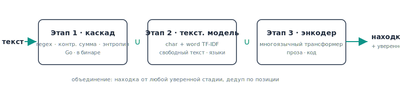

<p align="center">
  <picture>
    <source media="(prefers-color-scheme: dark)" srcset="assets/logo-dark.svg">
    
  </picture>
</p>

<p align="center"><a href="README.md">English</a> · <b>Русский</b></p>

<p align="center">
  Находит утёкшие учётные данные в коде, истории git, тикетах, логах, образах контейнеров и
  развёрнутых веб-приложениях - покрывая структурные токены и многоязычную прозу, с опциональной live-верификацией.
</p>

<p align="center">
  <a href="#установка"></a>
  
  
  
  
</p>

---

Prowl - это сканер секретов. Он читает кодовую базу, историю git, живую веб-страницу или поток
текста и сообщает об оставленных где-то учётных данных (API-ключи, токены, URI баз данных, приватные
ключи, пароли в тексте), указывая строку, столбец и уверенность. Цель -
**высокая полнота без потока ложных срабатываний.**

Большинство сканеров вынуждают выбирать. Regex-инструменты (gitleaks, trufflehog) точны на
структурированных токенах, но пропускают всё без фиксированного префикса; ML/семантические
инструменты (deepsecrets) читают произвольный текст, но рассыпаются на структурированных ключах. Prowl
запускает оба подхода как единый каскад - regex/checksum-точность на структурных токенах, ML-этап для
многоязычной прозы, которую префиксные инструменты пропускают, и опциональная live-верификация сверху.
Он не претендует на наименьшее число ложных срабатываний среди всех (настроенный префиксный сканер вроде
gitleaks может быть тише на чистом коде) - он стремится к самому широкому честному покрытию при рабочей точности. См.
[бенчмарк](#бенчмарк).

```console
$ prowl scan .

  src/config/prod.ts
    ✖ critical  aws_access_key_id      42:18   AKIA••••DSYP    live
  .env.example
    ✖ high      github_pat             3:11    ghp_••••a1b2
  docs/onboarding.md
    ⚠ medium    generic_password       88:24   Welc••••e!      71%

  3 findings  1 critical · 1 high · 1 medium  in 3 files
```

Находки сгруппированы по файлу (худшее первым), severity подсвечен цветом, секрет замаскирован.
JSON (`--format json`), SARIF (`--format sarif`, для вкладки Security в GitHub/GitLab) и DefectDojo
(`--format defectdojo`, формат Generic Findings Import для прямого импорта) - в один флаг.

## Установка

```sh
# Go
go install github.com/Lercas/prowl/tool/cmd/prowl@latest

# Docker
docker run --rm -v "$PWD:/src" ghcr.io/lercas/prowl scan /src

# из исходников
git clone https://github.com/Lercas/prowl && cd prowl/tool && make build
```

## Быстрый старт

```sh
prowl scan .                       # сканировать рабочее дерево
prowl scan . --staged              # только то, что в индексе (pre-commit)
prowl scan . --since HEAD~50       # только диффы последних 50 коммитов
prowl scan . --verify              # подтвердить каждое попадание через API провайдера
prowl scan . --format sarif -o out.sarif    # для code scanning / CI

prowl repo https://github.com/org/repo   # клонировать удалённый репозиторий (GitHub/GitLab/Bitbucket) и просканировать
GITHUB_TOKEN=... prowl org github:my-org   # просканировать каждый репозиторий в орге/группе/воркспейсе
prowl image alpine:latest                # стянуть и просканировать образ контейнера (каждый слой + конфиг)
prowl bucket s3://my-logs/2026/          # скачать и просканировать префикс S3 / GCS (через ваш CLI aws/gcloud)
kubectl get secret x -o yaml | prowl scan -   # сканировать ввод из stdin

prowl domain https://example.com --authorized   # HTML, JS-бандлы, source maps, __NEXT_DATA__
ATLASSIAN_EMAIL=... ATLASSIAN_API_TOKEN=... prowl jira https://acme.atlassian.net   # каждая версия issue (Cloud/Server/DC)
ATLASSIAN_PAT=... prowl confluence https://wiki.acme.com    # каждая версия страницы, с самой первой
prowl serve                        # stateless HTTP-воркер: POST /scan
```

Первый запуск устанавливает библиотеки правил и верификаторов; дальше они загружаются автоматически:

```sh
prowl rules update                 # скачать + проверить + установить ~/.prowl/rules
prowl verifiers update             # скачать + проверить + установить ~/.prowl/verifiers
prowl version                      # версии бинарника + установленных библиотек
```

### Меньше шума

Сократить то, что выводит сканирование, не трогая конфиг. Эти фильтры работают на этапе отчёта - и над встроенными находками, и над находками из шаблонов:

```sh
prowl scan . --min-severity high      # только находки high и выше
prowl scan . --min-confidence 0.7     # отбросить слабые находки с низкой уверенностью
prowl scan . --disable generic_high_entropy   # заглушить один шумный тип детектора
prowl scan . --no-dedupe              # показать каждое вхождение (по умолчанию - одно на файл)
```

Один и тот же секрет, встретившийся в файле несколько раз, по умолчанию выводится один раз; `--no-dedupe` показывает их все. [док](wiki/Scanning-Files.md#cutting-noise)

Полный справочник по всем командам, флагам и фичам - в [вики](wiki/README.md).

## Что можно сканировать

Один сканер, много источников - у каждого тот же каскад детектирования и те же флаги:

- **Каталог или файлы** - `prowl scan [path...]`, обход файловой системы. [док](wiki/Scanning-Files.md)
- **stdin** - `prowl scan -`, передать по конвейеру логи, вывод команды или отрендеренный манифест. [док](wiki/Scanning-Files.md)
- **Git** - файлы в индексе (`--staged`), дифф (`--since <rev>`) или каждый блоб в истории (`--history`). [док](wiki/Scanning-Files.md)
- **Удалённый репозиторий** - `prowl repo <git-url>`, клонировать и просканировать любой URL GitHub/GitLab/Bitbucket/self-hosted. [док](wiki/Repository-Scanning.md)
- **Целый орг / группа / воркспейс** - `prowl org <platform>:<name>`, все репозитории сразу. [док](wiki/Org-Scanning.md)
- **Образ контейнера** - `prowl image <ref>`, стянуть и просканировать каждый слой + конфиг образа, без демона. [док](wiki/Container-Scanning.md)
- **Префикс S3 / GCS** - `prowl bucket <s3://...|gs://...>`, скачать через ваш CLI aws/gcloud и просканировать. [док](wiki/Bucket-Scanning.md)
- **Живой домен** - `prowl domain <host> --authorized`, HTML + встроенные state-блобы + связанные JS и source maps. [док](wiki/Domain-Scanning.md)

## Почему Prowl

- **Точность прежде всего.** Трёхэтапный каскад (regex + контрольная сумма + энтропия, затем
  контекстная модель, затем глубокий энкодер) с фильтрацией примеров/плейсхолдеров, отбраковкой
  хешей и уверенностью по каждой находке. На бенчмарке ниже один каскад даёт высшую точность среди
  всех инструментов; ML-этапы немного уступают её ради лучшей полноты и лидирующего F1.
- **Находит то, что не по силам regex.** Пароли в немецком/французском/русском тексте, токены без
  фиксированного префикса, секреты, спрятанные внутри base64-блобов и JS source maps.
- **Проверяет вживую.** `--verify` обращается к собственному read-only эндпоинту идентификации
  провайдера (AWS, GitHub, Stripe, GCP, Yandex Cloud и так далее) и сообщает, какие секреты реально
  живы. Это сильнейший из возможных фильтров ложных срабатываний.
- **Правила живут вне бинарника.** 159 YAML-шаблонов, которые можно править, отключать
  или расширять, а ваши существующие наборы правил **gitleaks** `.toml` и **trufflehog** `.yaml`
  подключаются без изменений.
- **Быстро.** ~310 МБ/с в один поток, горячий путь без аллокаций, линейное масштабирование по ядрам.
  Префильтр Aho-Corasick делает так, что библиотека из 159 правил почти ничего не стоит.
- **Создан для пайплайнов.** CLI, pre-commit, GitHub Action, вывод в SARIF, гейтинг по коду возврата,
  режим LSP для подсветки в редакторе и режим `serve` для горизонтального масштабирования.

## Бенчмарк

[ProwlBench](https://github.com/Lercas/prowlbench) - безопасный к утечкам бенчмарк из 24 603 случаев
(16 552 позитива / 8 051 негатив), охватывающий структурированные токены, generic-ключи с высокой
энтропией, многоязычный произвольный текст (8 языков) и состязательные жёсткие негативы (хеши,
JWT-подобные не-токены, SSH public keys, плейсхолдеры, localhost-DSN, `${ENV}`-ссылки) в коде, Jira,
Confluence, Slack и логах. **Таблица ниже - буквальный рендер
leaderboard, опубликованного в репозитории [ProwlBench](https://github.com/Lercas/prowlbench);
воспроизводится его `python -m benchmark.run_prowlbench`.** Каждый инструмент - настоящий подпроцесс; значения не пересекаются с обучающими.

| Инструмент | Точность | Полнота | F1 | Аккуратность |
|------|:--:|:--:|:--:|:--:|
| **Prowl** (поставляемый Go-бинарь, каскад) | **0.951** | **0.823** | **0.883** | **0.853** |
| detect-secrets | 0.848 | 0.423 | 0.564 | 0.561 |
| gitleaks | 0.931 | 0.413 | 0.573 | 0.585 |
| deepsecrets | 0.921 | 0.309 | 0.462 | 0.517 |
| trufflehog | 0.940 | 0.303 | 0.458 | 0.518 |

Поставляемый единый Go-бинарь - каскад (regex + checksum + энтропия, ничего не нужно хостить) - лидирует
здесь по F1. **Читайте честно:** 57% позитивов - generic-пароли/ключи в многоязычной прозе, которые
gitleaks (regex по префиксам) и trufflehog (верификаторы провайдеров) не таргетят by design - на
распределении с преобладанием структурных токенов разрыв по полноте резко сужается (по-тировые числа в
[datasheet ProwlBench](https://github.com/Lercas/prowlbench)). Честная конкретная сила Prowl - полнота на многоязычной прозе,
а не отрыв по F1 по всей индустрии.

> Опциональный **ансамбль из 3 моделей** (каскад ∪ небольшой LR ∪ опубликованный
> [XLM-R энкодер](https://huggingface.co/Podric/prowl-secret-encoder)) поднимает полноту на многоязычной
> прозе до ~0.97-0.99 в исследовательских прогонах - но требует энкодер, которого **нет в чистом checkout**
> (gitignored / на Hugging Face), это **не поставляемый бинарь** и его **нет в закоммиченном
> `prowlbench_leaderboard.json`**, поэтому он сознательно не вынесен в заголовок; каноничный воспроизводимый
> результат - строка каскада выше. Любая строка с обученной моделью также несёт раскрытые ~5% пересечения train/test.

### Независимая кросс-тул проверка

Вторая, намеренно **нельстивая** проверка против текущих релизов всех остальных инструментов
(gitleaks 8.30, trufflehog 3.95, detect-secrets 1.5, deepsecrets 2.0). Академический корпус
[SecretBench](https://github.com/setu1421/SecretBench) закрыт за Google BigQuery, поэтому использованы два
воспроизводимых локальных набора: **(A)** 34 секрета в реальных форматах от 17 провайдеров + 12
сложных-но-чистых файлов (UUID/хеши/base64/плейсхолдеры) и **(B)** реальный чистый OSS-репозиторий
([`psf/requests`](https://github.com/psf/requests), 157 файлов), где каждая находка - кандидат в ложное
срабатывание. Одинаковый вход всем; скоринг по файлам; `trufflehog --no-verification` (ничего не уходит наружу).

| Инструмент | (A) Точность | (A) Полнота | (A) F1 | (B) находок на чистом коде |
|------|:--:|:--:|:--:|:--:|
| gitleaks | 1.00 | 0.94 | **0.97** | **4** ← чище всех |
| **Prowl** `--ml` | 1.00 | 1.00 | 1.00\* | **9** |
| detect-secrets | 0.89 | 0.94 | 0.91 | 15 |
| **Prowl** (только каскад) | 1.00 | 1.00 | 1.00\* | 18 (было 50 до фикса asset/expr-FP) |
| deepsecrets | 0.96 | 0.71 | 0.81 | 22 |
| trufflehog | 1.00 | 0.65 | 0.79 | 34 |

**Читайте честно - Prowl не выигрывает безоговорочно:**
- **\* Набор (A) смещён в пользу Prowl** (форматы секретов генерировал я, так что отчасти это «детектит ли
  Prowl Prowl-образные секреты»). Идеальная 1.00 - артефакт, не доказательство. Честный сигнал в (A) - только
  *покрытие*: Prowl + detect-secrets покрывают больше провайдеров; trufflehog/deepsecrets пропускают тех, для
  кого нет правила (разрыв покрытия, не качества).
- **На реальном чистом коде (B) gitleaks чище всех (4) и сильнейший здесь.** Каскад Prowl без зависимостей
  даёт 18 (было 50 до того, как этот релиз ужал asset/expression-FP); его **ML-фильтр L2 (`--ml`, нужна
  cgo-сборка или sidecar) срезает до 9** без потери ни одного из 34 позитивов корпуса - это и есть ответ на
  «чистим ли мы FP моделью?»: да, половину остаточного шума каскада, recall не изменился (L2 переобучена на
  hard-negatives, намайненных из реальных чистых репозиториев, с гейтом на held-out реальных данных - не на
  синтетике). Даже так Prowl ~2× шумнее gitleaks на реальном коде. Prowl меняет точность-на-реальном-коде на
  более широкое покрытие провайдеров и live-верификацию; нужен самый тихий чисто-regex сканер без ML - берите gitleaks.

## Как это работает

<p align="center">
  <picture>
    <source media="(prefers-color-scheme: dark)" srcset="assets/architecture-ru-dark.svg">
    
  </picture>
</p>

- **Этап 1, каскад (Go).** Regex по каждому типу, привязанные к литеральному ключевому слову,
  отсечённые префильтром Aho-Corasick, затем контрольная сумма (Luhn, GitHub CRC, структура JWT),
  энтропия Шеннона и контекстные подсказки строки. Отфильтровывает примеры, плейсхолдеры, хеши и
  материал публичных ключей. Этот этап поставляется в бинарнике и больше ничего не требует.
- **Этап 2, текстовая модель.** Логистическая регрессия на символьном + словном TF-IDF для generic
  и многоязычных паролей, которые regex не привязывают.
- **Этап 3, энкодер.** Дообученный многоязычный трансформер
  ([на Hugging Face](#модель--данные)) для произвольного и внутрикодового «хвоста». Опционален; каскад
  работает и без него.

Три этапа объединяются через union: всё, в чём уверен любой из этапов, становится находкой,
дедуплицированной по позиции.

## Правила и верификаторы

Правила детектирования - это простые шаблоны, по одному YAML-файлу на провайдера, с
матчерами `word` + `regex` + `entropy`, объединёнными через AND/OR:

```yaml
id: stripe-secret-key
info:
  name: Stripe Secret Key
  severity: critical
  tags: stripe,payment,credentials
matchers-condition: and
matchers:
  - type: word
    words: ["sk_live_"]
  - type: regex
    regex: ['\bsk_live_[0-9a-zA-Z]{24,}\b']
```

Верификаторы тоже основаны на данных: HTTP-запрос к эндпоинту идентификации провайдера плюс
условные матчеры на ответ, с подключаемой системой подписи (AWS SigV4, bearer, basic). Команды
AppSec добавляют новое детектирование и верификацию, не трогая Go. См.
[`rules/SCHEMA.md`](tool/rules/SCHEMA.md) и [`verifiers/SCHEMA.md`](tool/verifiers/SCHEMA.md), либо
сгенерируйте их с помощью промптов из `rules/PROMPT.md`.

```sh
prowl scan . --rules gitleaks.toml --rules trufflehog.yaml   # подключите свои
prowl rules list --tags aws,stripe                # библиотека по категориям
prowl rules show stripe-secret-key                # матчеры и ссылка одного правила
prowl rules test 'key = "sk_live_4eC39HqLyjWD..."'  # какие правила сработают на строке
prowl rules validate ./team-rules
```

## Модель и данные

Корпус бенчмарка и энкодер этапа 3 опубликованы на Hugging Face:

- **Модель:** [`Podric/prowl-secret-encoder`](https://huggingface.co/Podric/prowl-secret-encoder),
  многоязычный трансформер, стоящий за этапом 3.
- **Датасет:** [`Podric/prowl-secrets-corpus`](https://huggingface.co/datasets/Podric/prowl-secrets-corpus),
  503 тыс. размеченных записей (код, тикеты, логи, текст) с полным происхождением.

Оба приватны на время оценки. Самому инструменту не нужно ни то, ни другое; каскад самодостаточен.

## Конфигурация

Файл `.prowl.yaml` в корне репозитория переключает правила и настраивает allowlist
(совместимо с gitleaks):

```yaml
detectors:
  disable: [generic_high_entropy]        # turn rules off
allowlist:
  stopwords: [example, dummy]
  paths: ['_test\.go$', 'testdata/']
```

Подавить отдельную строку в исходнике можно встроенной прагмой `prowl:allow` (а также учитывается
`gitleaks:allow`).

Файл `.prowl.yaml`, найденный внутри сканируемого дерева, контролируется чужим кодом, когда вы
сканируете не свой репозиторий, поэтому конфиг, отключающий детекторы или добавляющий allowlist,
выводит предупреждение - передайте `--config FILE`, чтобы явно ему доверять. Живая верификация
(`--verify`) и `prowl domain` отказываются подключаться к приватным/loopback-адресам (защита от
SSRF); установите `PROWL_ALLOW_PRIVATE_IPS=1`, если запускаете верификаторы против внутреннего или
self-hosted эндпоинта.

## Сборка

```sh
cd tool
make build          # -> ./prowl
make test           # unit + integration
make e2e            # 50 end-to-end scenarios
make ci             # fmt + vet + build + race + e2e
```

Требуется Go 1.25+. Никаких внешних сервисов. `tool/` - это сканер (Go). Правила детектирования и
живые верификаторы лежат в отдельном репозитории [Lercas/prowl-templates](https://github.com/Lercas/prowl-templates)
(устанавливаются командой `prowl rules update`); бенчмарк - [Lercas/prowlbench](https://github.com/Lercas/prowlbench).

## Лицензия

Prowl распространяется по **PolyForm Noncommercial License 1.0.0**: бесплатно для некоммерческого использования, но не для использования в коммерческих продуктах. См. [LICENSE](LICENSE).
